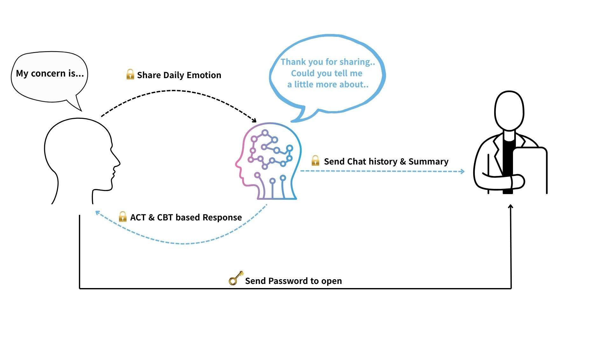

# Elog(Emotion Log) Chatbot

This project is an AI-powered counseling Telegram chatbot based on **Acceptance and Commitment Therapy (ACT)** and **Cognitive Behavioral Therapy (CBT)**. All conversations with the user are protected with end-to-end encryption, and users can securely share their counseling records with a professional counselor whenever they choose.



## ✨ Key Features

  * **AI-Powered Counseling**: Provides interactive, conversational counseling based on ACT/CBT principles using OpenAI's language models.
  * **Robust Security**:
      * **Conversation Encryption**: All conversations are encrypted using the AES-GCM algorithm before being stored on the server, ensuring that even server administrators cannot view the content. <암호화 단계 이미지화 하기>
      * **Data Integrity**: A Hash Chain is implemented to prevent any tampering or alteration of the conversation logs.
  * **Secure Log Sharing**:
      * Users can export their conversation history from a specified period, along with an AI-generated summary, into a single ZIP file.
      * A secure download link, protected by a **One-Time Password (OTP)**, is sent to the counselor's email, ensuring that only authorized individuals can access the file.
  * **Telegram Integration**: Users can access the chatbot anytime, anywhere through the familiar Telegram messaging app.

-----

## 🚀 Getting Started

### Prerequisites

  * Python 3.8+
  * Telegram Bot Token
    <br>[How to get Bot Token](https://docs.radist.online/docs/our-products/radist-web/connections/telegram-bot/instructions-for-creating-and-configuring-a-bot-in-botfather)
  * Azure OpenAI API Key and Endpoint Information
    <br>[What is API Key and Endpoint](https://www.datacamp.com/tutorial/azure-openai)
  * A Gmail account (or other SMTP server info) for sending emails

### Installation & Setup

1.  **Clone the repository**

    ```bash
    git clone https://github.com/Giiinger/Elog_bot.git
    cd YOUR_REPOSITORY
    ```

2.  **Install required libraries**
    Install all dependencies using the `requirements.txt` file.

    ```bash
    pip install -r requirements.txt
    ```

3.  **Set up the `.env` file**
    Create a file named `.env` in the project's root directory and fill in the following values. This file is listed in `.gitignore` and will not be uploaded to GitHub.

    ```env
    # Azure OpenAI
    AZURE_API_KEY="<YOUR_AZURE_API_KEY>"
    AZURE_API_ENDPOINT="<YOUR_AZURE_ENDPOINT>"
    AZURE_DEPLOYMENT_NAME="<YOUR_DEPLOYMENT_NAME>"

    # Telegram
    TELEGRAM_BOT_TOKEN="<YOUR_TELEGRAM_BOT_TOKEN>"

    # SMTP (Gmail example)
    SMTP_EMAIL="<YOUR_GMAIL_ADDRESS>"
    SMTP_PASSWORD="<YOUR_GMAIL_APP_PASSWORD>" # ❗️ Must be a Gmail App Password.

    # Security Keys (Generate these yourself using the command below)
    # python -c "import secrets; print(secrets.token_hex(32))"
    MASTER_KEY="<PASTE_YOUR_GENERATED_32-BYTE_MASTER_KEY_HERE_IN_BASE64>"
    SECRET_LINK_KEY="<PASTE_YOUR_GENERATED_32-BYTE_SECRET_LINK_KEY_HERE_IN_BASE64>"

    # Web Server URL for secure downloads
    BASE_URL="http://<YOUR_SERVER_IP_OR_DOMAIN>"
    ```

4.  **Run the chatbot**

    ```bash
    python main.py
    ```

    The chatbot will now be running on Telegram.

### Project Structure

```bash
/Elog_bot/
├── .env
├── main.py                 # <-- 프로그램 실행 시작점 (가장 바깥에 위치)
├── prompt_templates/
│   ├── ACT_Guide.txt
│   └── summary.txt
├── user_data/
│
└── bot/                    # <-- 핵심 로직이 담길 메인 패키지
    ├── __init__.py         # --- 이 폴더를 패키지로 만들어줍니다.
    │
    ├── core/               # --- 핵심 비즈니스 로직 그룹
    │   ├── __init__.py
    │   ├── data_manager.py
    │   ├── llm_handler.py
    │   ├── security_utils.py
    │   └── export_handler.py
    │
    ├── handlers/           # --- 사용자 입력 및 외부 요청 처리 그룹
    │   ├── __init__.py
    │   ├── telegram_handlers.py
    │   └── web_server.py
    │
    └── config.py           # --- 설정 관련 모듈
```


-----

## 📖 Usage (Telegram Commands)

  * `/start`
    Starts the bot and displays a welcome message with instructions.
    

  * `/register <counselor_email>`
    Registers the counselor's email address where conversation logs will be sent.

      * **Example**: `/register my_counselor@example.com`

  * `/send <start_date> <end_date>`
    Exports the conversation history and summary for the specified date range, zips it, and sends a secure download link to the registered counselor's email. The user receives an OTP required for the download and should let the counselor know the password to open.

      * **Example**: `/send 2025-01-01 2025-01-31`
    

  * `/revoke <revoke_id>`
    Immediately invalidates a previously generated secure download link.

    * **Example**: `/revoke ACT-251013-R`
    
